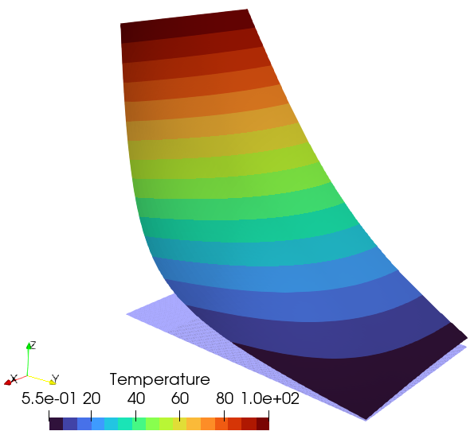

````julia
module T4NAFEMS_examples
using FinEtools
using FinEtoolsHeatDiff
using FinEtoolsHeatDiff.AlgoHeatDiffModule
using FinEtools.AlgoBaseModule: richextrapol

function T4NAFEMS_T3_algo()
````

## Two-dimensional heat transfer with convection: convergence study

````julia
    ### Description
````

Consider a plate of uniform thickness, measuring 0.6 m by 1.0 m. On one
short edge the temperature is fixed at 100 °C, and on one long edge the
plate is perfectly insulated so that the heat flux is zero through that
edge. The other two edges are losing heat via convection to an ambient
temperature of 0 °C. The thermal conductivity of the plate is 52.0 W/(m
.°K), and the convective heat transfer coefficient is 750 W/(m^2.°K).
There is no internal generation of heat. Calculate the temperature 0.2 m
along the un-insulated long side, measured from the intersection with the
fixed temperature side. The reference result is 18.25 °C.

The reference temperature at the point A  is 18.25 °C according to the
NAFEMS publication (which cites the book Carslaw, H.S. and J.C. Jaeger,
Conduction of Heat in Solids. 1959: Oxford University Press).

The present  tutorial will investigate the reference temperature  and it
will attempt to  estimate the  limit value more precisely using a
sequence of meshes and Richardson's extrapolation.



### Solution

````julia
    println("""
    NAFEMS benchmark.
    Two-dimensional heat transfer with convection: convergence study.
    Solution with linear triangles.
    Version: 02/23/2024
    """)
````

Conductivity matrix

````julia
    kappa = [52.0 0; 0 52.0] * phun("W/(M*K)")
````

Surface heat transfer coefficient

````julia
    h = 750 * phun("W/(M^2*K)")
````

Geometrical dimensions

````julia
    Width = 0.6 * phun("M")
    Height = 1.0 * phun("M")
    HeightA = 0.2 * phun("M")
    Thickness = 0.1 * phun("M")
    tolerance = Width / 1000
````

Create a material model.

````julia
    m = MatHeatDiff(kappa)
````

Five progressively refined models will be created and solved.

````julia
    modeldata = nothing
    resultsTempA = Float64[]
    params = Float64[]
    for nref in 2:6
````

The mesh is created from two rectangular blocks to begin with.

````julia
        fens, fes = T3blockx([0.0, Width], [0.0, HeightA])
        fens2, fes2 = T3blockx([0.0, Width], [HeightA, Height])
````

The meshes are then glued into a single entity.

````julia
        fens, newfes1, fes2 = mergemeshes(fens, fes, fens2, fes2, tolerance)
        fes = cat(newfes1, fes2)
````

Refine the mesh desired number of times.

````julia
        for ref in 1:nref
            fens, fes = T3refine(fens, fes)
        end
````

The boundary is extracted.

````julia
        bfes = meshboundary(fes)
````

The prescribed temperature is applied along edge 1 (the bottom
edge in Figure 1).

````julia
        list1 = selectnode(fens; box = [0.0 Width 0.0 0.0], inflate = tolerance)
        essential1 = FDataDict("node_list" => list1, "temperature" => 100.0)
````

The convection (surface heat transfer) boundary condition is applied
along the edges 2,3,4.

````julia
        list2 = selectelem(fens, bfes; box = [Width Width 0.0 Height], inflate = tolerance)
        list3 = selectelem(fens, bfes; box = [0.0 Width Height Height], inflate = tolerance)
````

The boundary integrals are evaluated using a surface FEMM.

````julia
        cfemm = FEMMHeatDiffSurf(
            IntegDomain(subset(bfes, vcat(list2, list3)), GaussRule(1, 3), Thickness),
            h,
        )
        convection1 = FDataDict("femm" => cfemm, "ambient_temperature" => 0.0)
````

The interior integrals are evaluated using a volume FEMM.

````julia
        femm = FEMMHeatDiff(IntegDomain(fes, TriRule(3), Thickness), m)
        region1 = FDataDict("femm" => femm)
````

Make the model data

````julia
        modeldata = FDataDict(
            "fens" => fens,
            "regions" => [region1],
            "essential_bcs" => [essential1],
            "convection_bcs" => [convection1],
        )
````

Call the solver

````julia
        modeldata = AlgoHeatDiffModule.steadystate(modeldata)
````

Locate the node at the point A  [coordinates (Width,HeightA)].

````julia
        list4 = selectnode(fens; box=[Width Width HeightA HeightA], inflate=tolerance)
````

Collect the temperature  at the point A.

````julia
        Temp = modeldata["temp"]
        println("$(Temp.values[list4][1])")
        push!(resultsTempA, Temp.values[list4][1])
        push!(params, 1.0 / 2^nref)
    end
````

These are the computed results for the temperature at point A:

````julia
    println("$( resultsTempA  )")
````

Richardson extrapolation can be used to estimate the limit.

````julia
    solnestim, beta, c, residual =
        richextrapol(resultsTempA[(end-2):end], params[(end-2):end])
    println("Solution estimate = $(solnestim)")
    println("Convergence rate estimate  = $(beta)")
````

Postprocessing

````julia
    geom = modeldata["geom"]
    Temp = modeldata["temp"]
    regions = modeldata["regions"]
    vtkexportmesh(
        "T4NAFEMS--T3-solution.vtk",
        connasarray(regions[1]["femm"].integdomain.fes),
        [geom.values (Temp.values / 100)],
        FinEtools.MeshExportModule.VTK.T3;
        scalars = [("Temperature", Temp.values)],
    )
    vtkexportmesh(
        "T4NAFEMS--T3-mesh.vtk",
        connasarray(regions[1]["femm"].integdomain.fes),
        geom.values,
        FinEtools.MeshExportModule.VTK.T3,
    )
    true
end # T4NAFEMS_T3_algo

T4NAFEMS_T3_algo()
end # module
nothing
````

---

*This page was generated using [Literate.jl](https://github.com/fredrikekre/Literate.jl).*

